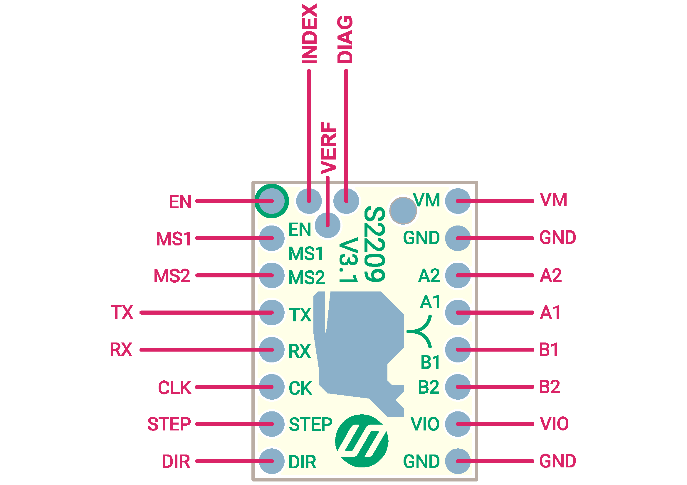

## Product Introduction
---

The TMC2209 is an ultra-silent motor driver IC for two phase stepper motors. TMC2209 pinning is compatible to a number of legacy drivers as well as to the TMC2208. TRINAMICs sophisticated StealthChop2 chopper ensures noiseless operation,maximum efficiency and best motor torque. Its fast current regulation and optional combination with SpreadCycle allow highly dynamic motion while adding. StallGuard for sensorless homing. The integrated power MOSFETs handle motor currents up to 2A RMS with protection and diagnostic features for robust and reliable operation. A simple to use UART interface opens up tuning and control options. Store application tuning to OTP memory.Industries’ most advanced STEP/DIR stepper motor driver family upgrades designs to noiseless and most precise operation for cost-effective and highly competitive solutions.Step/Dir Drivers for Two-Phase Bipolar Stepper Motors up to 2.8A peak –StealthChop™ for Quiet Movement – UART Interface Option –Sensorless Stall Detection StallGuard4. 

## Features
---

- 2-phase stepper motors up to 2.8A coil current (peak), 2A RMS 
- STEP/DIR Interface with 8, 16, 32 or 64 microstep pin setting
- Smooth Running 256 microsteps by MicroPlyer™ interpolation 
- StealthChop2™ silent motor operation 
- SpreadCycle™ highly dynamic motor control chopper
- StallGuard4™ load and stall detection for StealthChop 
- CoolStep™ current control for energy savings up to 75%
- Low RDSon, Low Heat-Up LS 170mΩ & HS 170mΩ (typ. at 25°C) t
- Voltage Range 4.75… 29V DC 
- Low Power Standby to fit standby energy regulations
- Internal Sense Resistor option (no sense resistors required) 
- Passive Braking, Freewheeling, and automatic power down 
- Single Wire UART & OTP for advanced configuration options 
- Integrated Pulse Generator for standalone motion 
- Full Protection & Diagnostics 

## Technical Specifications

Model                                    | TMC2209 
:---:|:---:
Interface                                |   Step/Dir 
Configuration                       |   CFG Pins or UART
Native Microsteps               |   up to 1/256
microPlyer Microsteps          |    1/256
Logic Voltage (VIO)                 |    3-5V
Motor Voltage (VM)                | 5.5-28V 
Motor Phase Current  max        | 2A RMS, 2.8A Peak 
Internal V-  Regulator         |    enabled
RDSon                                    |0.1 Ohm (HV 0.2 Ohm)
stealthChop (quiet)               | yes
spreadCycle                           |      yes
coolStep                                | yes 
stallGuard                              | yes 
dcStep                                    | yes 

## Pin Functions
---
### V3.0

### V3.1

Pin|Function
:---:|---
 |**Power Supply**
 GND|	Ground
VM|	Motor Supply Voltage
VIO	|Logic Supply Voltage
|**Motor Outputs**
M1A|	Motor Coil 1
M1B	|Motor Coil 1
M2A|	Motor Coil 2
M2B	|Motor Coil 2
|**Control Inputs**
STEP	|Step-Signal Input
DIR	|Direction-Signal Input
|**TMC2209**
 EN|	Enable Motor Outputs: GND=on, VIO=off
MS1| Microstep resolution configuration (internal pull-down resistors)
MS2| MS1: 00: 1/8, 01: 1/2, 10: 1/4 11: 1/16 For UART based configuration selection of UART Address 0…3 
SP	|Chopper mode selection: Low/pin open=StealthChop, High=SpreadCycle
CLK	|CLK input. Tie to GND using short wire for internal clock or supply external clock.
TX	|UART TX,   Connected to the PDN via a 1K resistor on board
RX	|UART RX,   Directly connected to the PDN
DIAG	|Diagnostic and StallGuard output. Hi level upon stall detection or driver error. Reset error condition by ENN=high.
INDEX	|Configurable index output. Provides index pulse.
VREF|	Analog Reference Voltage

## Interface Resources
---
###  Wiring Diagram

### Motor Current Setting

**Below  V2.1:** 

**V3.0&3.1**

The best way to set the motor current is by measuring the voltage on the Vref pin (0…2.5V) and adjusting the voltage with the potentiometer. The maximum settable motor current is 1.77A RMS (0.11Ohm sense resistors), but the SilentStepSticks can only be used up to 1.2A RMS.  
Irms = (Vref * 1.77A) / 2.5V = Vref * 0.71  
Vref = (Irms * 2.5V) / 1.77A = Irms * 1.41 = Imax   
Vref -> Voltage on Vref pin  
Irms -> RMS (Root Mean Square) current per phase (Irms = Imax / 1.41)  
Imax -> Maximum current per phase (Imax = Irms * 1.41)   

!!!Note
​    1. Vref measures Gnd and the voltage at the middle of the potentiometer.  
​    2. Do not connect the motor when measuring the voltage, otherwise it is easy to burn the driver.  
​    3. Power should be connected when measuring voltage, do not just connect USB power supply.  
​    4. **Please pay special attention to directions!**

### Calculator

<form name="data">
RMS Current (A): <input type="text" name="i"  value="0.6" style="width:60px;" size="5">
Reference Voltage (V): <input readonly type="text" name="v" value="" style="width:60px;" size="5">
<input type="button" name="go" value="calculate" onclick="var i=document.forms['data'].i.value; i=i.replace(',','.'); var v=new Number(i); v=v*1.41; v=v.toFixed(2); document.forms['data'].v.value=v; return false;">
</form>

### Micro-stepping

MS2(-)	|MS1(-)|	Steps(-)|	Interpolation(-)|	Mode(-)
:---:|:---:|:---:|:---:|:---:
GND |	VIO | 1⁄2 | 1⁄256 | stealthChop2
VIO	| GND | 1⁄4 | 1⁄256 | stealthChop2
GND | GND | 1⁄8 | 1⁄256 | stealthChop2
VIO	| VIO | 1⁄16 | 1⁄256 | stealthChop2

## Setting Method

----

### V2.1 Hardware Connection

You can use every RS232 serial adapter with 0-5V logic levels (e.g. FTDI-Breakout) and the SilentStepStick Tester/Programmer can be used as connection adapter.

!!!Tip
    The FYSETC TMC2209V2.1 version has been set with jumpers, and the TX and RX pins are lengthened for easy wiring. You only need to follow the silk screen to wire and use.

### V3.0 Hardware Connection

!!!Note

### V3.1 Hardware Connection

1. add CLK pin ，not connect in default，tie to GND via 0R
2. SPREAD pin is floating. Reserve pull-up and pull-down resistors.
3. Move TX from 3 to 5
4. UART mode is compatible with F6,S6,SKR series and MKS series motherboards.

---

## Shop	

---
- [TMC2209](https://www.aliexpress.com/item/33025556705.html)

## Tech Support

---
Please submit any technical issue into our [forum](http://forum.fysetc.com/) 